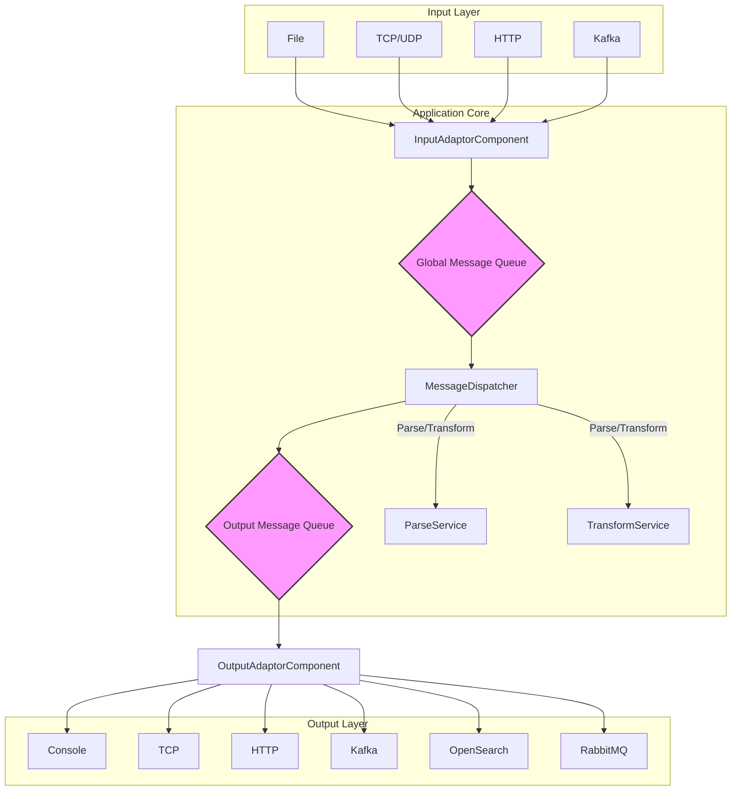

# 프로젝트 개요 및 구조

  이 프로젝트는 다양한 소스에서 로그 데이터를 수신하여, 지정된 규칙에 따라 파싱하고 변환한 후, 여러 목적지로 전송하는 ETL(Extract,
  Transform, Load) 파이프라인 애플리케케이션입니다.

   - 특징: application.yml 설정 파일을 통해 전체 데이터 흐름을 정의합니다. 코드를 수정하지 않고도 새로운 Input, Parser, Output 등을
     추가하거나 변경할 수 있는 유연하고 확장 가능한 구조입니다.
   - 동작 방식:
       1. Input: 설정된 어댑터(File, TCP, Kafka 등)가 외부로부터 로그 데이터를 수신합니다.
       2. Dispatch: 수신된 데이터는 내부 큐(Queue)로 전달됩니다.
       3. Parse & Transform: 별도의 스레드들이 큐에서 데이터를 가져와 Grok, JSON, 정규식 등 설정된 파서로 데이터를 정형화하고, 필터링,
          속성 추가/제거 등의 변환 작업을 수행합니다.
       4. Output: 처리된 데이터는 다시 출력 큐로 보내지며, 최종적으로 콘솔, Kafka, OpenSearch 등 설정된 목적지로 전송됩니다.

## 프로젝트 구조도 (Mermaid)


<details>
  <summary>Click to expand(Mermaid)</summary>

</details>


## ETC

본 문서는 Gemini cli(2.5 pro)를 통해 작성되었습니다.

---
## 사용 방법

### 1. 설정 (application.yml)

`src/main/resources/application.yml` 파일의 `logparser` 섹션에서 데이터 파이프라인을 설정합니다.

- **input**: 로그를 수신할 방법을 정의합니다. (예: `FileInputAdapter`, `TcpInputAdapter`)
- **parser**: 수신된 로그를 파싱할 방법을 정의합니다. `messagetype`을 통해 특정 `input`과 연결됩니다. (예: `JsonParser`, `RFC5424SyslogParser`)
- **transform**: 파싱된 데이터를 변환하는 규칙을 정의합니다. (예: `Filter`, `AddProperty`)
- **output**: 처리된 데이터를 내보낼 방법을 정의합니다. (예: `ConsoleOutputAdapter`, `KafkaOutputAdapter`)

#### 설정 예시
로컬의 `eve.json` 파일을 읽어 JSON으로 파싱한 후, 콘솔로 출력하는 예시입니다.

```yaml
logparser:
  input: 
    -
      type : FileInputAdapter
      path : "./eve.json"
      messagetype : eve
      isFromBeginning: true
    
  parser:
    - type: JsonParser
      messagetype: eve

  transform:
    # (필요시 변환 규칙 추가)
    - type: AddProperty
      messagetype: eve
      param:
        add:
          processed_by: logparser

  output: 
    -
      type : ConsoleOutputAdapter
      messagetype : eve
```

### 2. 빌드

프로젝트 루트 디렉터리에서 아래 명령어를 실행하여 애플리케이션을 빌드합니다.

```bash
./gradlew build
```

### 3. 실행

빌드가 완료되면 `build/libs` 디렉터리에 JAR 파일이 생성됩니다. 아래 명령어로 애플리케이션을 실행합니다.

```bash
java -jar build/libs/logparser-0.0.1-SNAPSHOT.jar
```

(JAR 파일 이름은 버전에 따라 다를 수 있습니다.)
