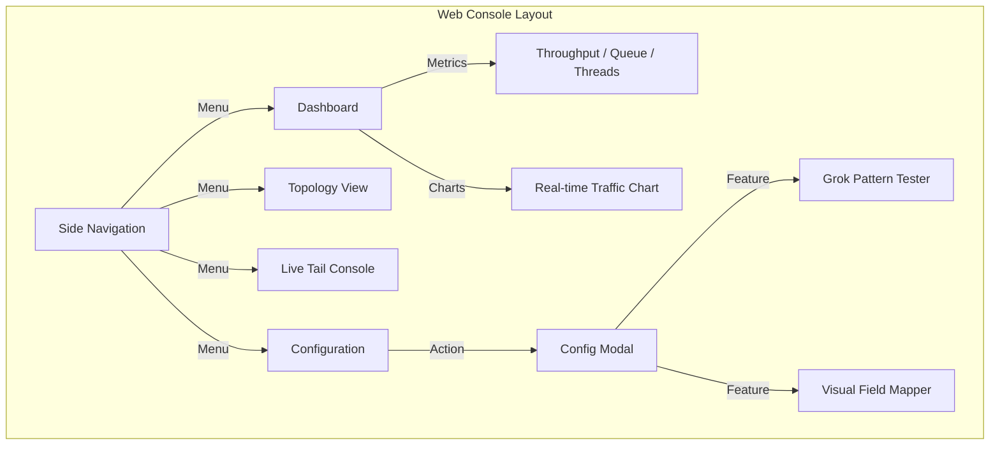
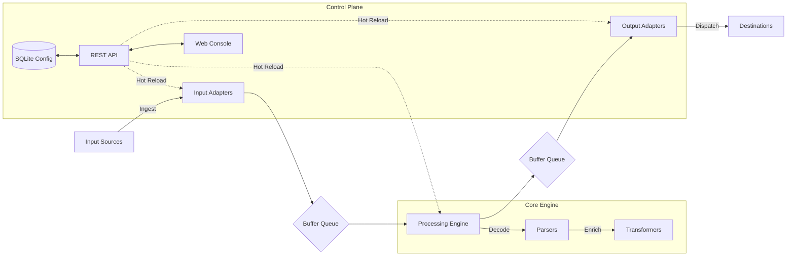

# Logparser (로그파서)

[](https://github.com/keinus/logparser)
[](https://opensource.org/licenses/MIT)
[](https://github.com/keinus/logparser)
[](https://www.oracle.com/java/)
[](https://spring.io/projects/spring-boot)
[](https://daisyui.com/)

**Logparser**는 Spring Boot 기반의 고성능 로그 처리 파이프라인 엔진입니다.
데이터 수집부터 정제, 변환, 적재까지의 전 과정을 **SIEM 스타일의 모던 웹 콘솔**을 통해 실시간으로 모니터링하고 제어할 수 있습니다.

데이터베이스 기반의 동적 설정 관리와 핫 리로드(Hot-Reload) 기능을 통해, 서비스 중단 없이 파이프라인 구성을 변경할 수 있습니다.

---

## 📋 목차

- [Logparser (로그파서)](#logparser-로그파서)
  - [📋 목차](#-목차)
  - [🖥️ 웹 콘솔 (UI)](#️-웹-콘솔-ui)
    - [UI 구조 (Wireframe)](#ui-구조-wireframe)
    - [주요 화면 구성](#주요-화면-구성)
  - [🏗 아키텍처](#-아키텍처)
  - [🛠 기술 스택](#-기술-스택)
  - [🚀 시작하기](#-시작하기)
    - [전제 조건](#전제-조건)
    - [설치 및 실행](#설치-및-실행)
  - [📡 API 명세](#-api-명세)
  - [📜 라이선스](#-라이선스)

---

## 🖥️ 웹 콘솔 (UI)

Logparser는 내장된 웹 서버를 통해 관리 콘솔을 제공합니다. 애플리케이션 실행 후 브라우저에서 접속하세요.
- **URL**: `http://localhost:8765`

### UI 구조 (Wireframe)


```mermaid
graph TD
    subgraph "Web Console Layout"
        Sidebar[Side Navigation] -->|Menu| Dashboard
        Sidebar -->|Menu| PipelineView[Topology View]
        Sidebar -->|Menu| LiveTail[Live Tail Console]
        Sidebar -->|Menu| Config[Configuration]
        
        Dashboard -->|Metrics| KPI[Throughput / Queue / Threads]
        Dashboard -->|Charts| Graph[Real-time Traffic Chart]
        
        Config -->|Action| Modal[Config Modal]
        Modal -->|Feature| GrokTest[Grok Pattern Tester]
        Modal -->|Feature| Mapper[Visual Field Mapper]
    end
```

### 주요 화면 구성
1.  **Overview**: 시스템 전체 상태 요약, 실시간 트래픽 그래프, 컴포넌트별 상태.
2.  **Live Tail**: 실시간 로그 스트림 확인 (일시정지/재개 지원).
3.  **Components**: Input, Parser, Transform, Output 어댑터의 CRUD 및 개별 제어.
4.  **Configuration**: 스레드 풀 튜닝 등 시스템 전역 설정.

---

## 🏗 아키텍처

Logparser의 데이터 처리 흐름은 유연한 파이프라인 구조를 따릅니다.


```mermaid
graph LR
    Input[Input Sources] -->|Ingest| IA[Input Adapters]
    IA --> Q1{Buffer Queue}
    Q1 --> Process[Processing Engine]
    
    subgraph "Core Engine"
        Process -->|Decode| P[Parsers]
        P -->|Enrich| T[Transformers]
    end
    
    Process --> Q2{Buffer Queue}
    Q2 --> OA[Output Adapters]
    OA -->|Dispatch| Dest[Destinations]

    subgraph "Control Plane"
        DB[(SQLite Config)] <--> API[REST API]
        API <--> UI[Web Console]
        API -.->|Hot Reload| IA
        API -.->|Hot Reload| Process
        API -.->|Hot Reload| OA
    end
```

1.  **Input Adapter**: File, TCP, UDP, Kafka, HTTP 등 다양한 소스에서 데이터 수집.
2.  **Processing Engine**: 단일 처리 파이프라인에서 파싱(Grok/Json)과 변환(Filter/Masking)을 효율적으로 수행.
3.  **Output Adapter**: Kafka, OpenSearch, RDB, Console 등으로 데이터 전송.
4.  **Control Plane**: 웹 콘솔을 통한 설정 변경을 감지하고 엔진에 즉시 반영(Hot-Reload).

---

## 🛠 기술 스택

| 분류 | 기술 |
| :--- | :--- |
| **Backend** | Java 21, Spring Boot 3.5.8, Gradle |
| **Frontend** | HTML5, **Tailwind CSS**, **DaisyUI**, Chart.js (No-Build Stack) |
| **Database** | SQLite (Embedded Config DB), JPA/Hibernate |
| **Core Libs** | Java Grok, Spring Kafka, Spring AMQP |
| **Docs** | SpringDoc OpenAPI (Swagger) |

---

## 🚀 시작하기

### 전제 조건
- **Java JDK 21** 이상

### 설치 및 실행

1.  **저장소 클론**
    ```bash
    git clone https://github.com/keinus/logparser.git
    cd logparser
    ```

2.  **빌드**
    ```bash
    ./gradlew build
    ```

3.  **실행**
    ```bash
    # 보안 키 설정 (선택 사항)
    export LOGPARSER_CRYPTO_KEY="$(openssl rand -base64 32)"
    
    # 실행
    java -jar build/libs/logparser-0.2.3.jar
    ```

4.  **접속**
    - 웹 콘솔: `http://localhost:8765`
    - API 문서: `http://localhost:8765/swagger-ui.html`

---

## 📡 API 명세

UI에서 수행하는 모든 작업은 REST API를 통해 프로그래밍 방식으로도 제어할 수 있습니다.

- **Pipeline**: `/api/v1/pipeline` (상태 조회, 리로드, 재시작)
- **Adapters**: `/api/v1/{input|output}-adapters` (생성, 수정, 삭제)
- **Processors**: `/api/v1/{parsers|transforms}` (패턴 테스트, 매핑 설정)
- **Metadata**: `/api/v1/metadata` (지원 타입 및 스키마 조회)

---

## 📜 라이선스
MIT License