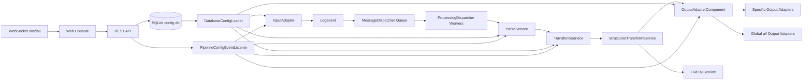

# Logparser

Logparser는 Spring Boot 기반의 로그 수집, 파싱, 변환, 구조화, 전송 파이프라인입니다.
입력 어댑터가 외부 로그를 `LogEvent`로 만들고, 중앙 큐와 worker가 메시지 타입별 파서와 변환을 적용한 뒤 출력 어댑터로 동기 fan-out 전송합니다.

입력 어댑터, 파서, 변환기, 출력 어댑터, 공통 설정, 구조화 매핑을 SQLite에 저장하고, 웹 콘솔과 REST API를 통해 실행 중에도 구성을 변경할 수 있습니다.

애플리케이션은 설정 DB가 비어 있어도 기동되며, 이후 UI 또는 API로 파이프라인을 채워 넣는 방식으로 사용할 수 있습니다.

## 주요 기능

- 입력, 파서, 변환, 출력 구성을 DB에 저장하고 런타임에 반영
- `messagetype` 기준 파이프라인 구성
- 중앙 입력 큐와 `parser_threads` 기반 다중 processing worker
- 입력/출력 어댑터 변경 시 증분 추가, 재시작, 제거
- 파서/변환 변경 시 DB 설정 재로드
- output adapter별 성공/실패/latency metric 제공
- 내장 웹 콘솔에서 Overview, Live Tail, Pipeline View, 설정 CRUD 제공
- REST API와 Swagger UI 제공
- WebSocket 기반 실시간 Live Tail
- 파서 테스트 API 및 파이프라인 검증 API 제공
- 중앙 구조화 변환(Structured Transform) 스키마 조회, 매핑 저장, 시뮬레이션 지원
- Flyway 기반 DB 스키마 관리
- 민감 정보(OpenSearch/RabbitMQ 비밀번호) 암호화 저장 지원

## 아키텍처


```mermaid
flowchart LR
    A[InputAdapter] --> B[LogEvent]
    B --> C[MessageDispatcher Queue]
    C --> D[ProcessingDispatcher Workers]
    D --> E[ParseService]
    E --> F[TransformService]
    F --> G[StructuredTransformService]
    G --> H[OutputAdapterComponent]
    H --> I[Specific Output Adapters]
    H --> J[Global all Output Adapters]
    G --> K[LiveTailService]

    DB[(SQLite config.db)] --> L[DatabaseConfigLoader]
    L --> A
    L --> E
    L --> F
    L --> H

    UI[Web Console] --> API[REST API]
    API --> DB
    API --> R[PipelineConfigEventListener]
    R --> A
    R --> E
    R --> F
    R --> H
    WS[WebSocket /ws/tail] --> UI
```

처리 순서:

1. 입력 어댑터가 원본 문자열, source host, `messagetype`, timestamp를 가진 `LogEvent`를 생성합니다.
2. `MessageDispatcher`가 이벤트를 bounded queue에 넣습니다. 기본 queue 크기는 `log.message.queue-size`이며 기본값은 `10000`입니다.
3. `parser_threads` 수만큼 생성된 `ProcessingDispatcher` worker가 queue에서 이벤트를 꺼냅니다.
4. `ParseService`가 같은 `messagetype`의 enabled parser를 priority 오름차순으로 실행합니다.
5. `TransformService`가 같은 `messagetype`의 enabled transform을 priority 오름차순으로 실행합니다. transform이 `false`를 반환하면 이벤트는 출력되지 않습니다.
6. `StructuredTransformService`가 구조화 매핑을 적용합니다. 매핑이 없으면 기본 구조화 이벤트를 만들고 원본 파싱 필드는 `additionalAttributes`에 유지합니다.
7. `OutputAdapterComponent`가 같은 `messagetype` 출력 어댑터와 전역 출력 어댑터(`messagetype=all`)에 동기 전송합니다.
8. Live Tail이 활성화되어 있으면 처리된 이벤트 일부를 `/ws/tail` 세션으로 브로드캐스트합니다.

## 지원 컴포넌트

런타임 factory는 `type` 값으로 클래스명을 조합해 구현체를 reflection으로 로드합니다.
API와 DB 설정에서는 `FileInputAdapter`, `JsonParser`, `ConsoleOutputAdapter`처럼 현재 클래스명을 사용하는 것이 안전합니다.

### Input Adapters

| 타입 | 필수/주요 필드 | 현재 동작 |
| --- | --- | --- |
| `FileInputAdapter` | `path`, `isFromBeginning` | 파일을 line 단위로 tailing합니다. 파일 크기 감소를 로그 로테이션으로 보고 다시 엽니다. |
| `TcpInputAdapter` | `port` | TCP server socket을 열고 client별 handler thread에서 line 단위 메시지를 내부 큐로 전달합니다. |
| `UdpInputAdapter` | `port` | UDP datagram 하나를 메시지 하나로 처리합니다. 최대 packet size는 1600 bytes입니다. |
| `HttpInputAdapter` | `port` | low-level `ServerSocket`으로 HTTP 요청 전체를 원본 문자열로 읽습니다. Spring MVC endpoint routing이 아니며 `pathPattern`은 현재 수신 로직에 사용되지 않습니다. |
| `KafkaInputAdapter` | `bootstrapservers`, `topicid`, `groupId` | Kafka consumer로 topic을 poll하고 메시지 value를 이벤트로 만듭니다. `groupId`가 없으면 UUID를 사용합니다. |
| `FakeInputAdapter` | 없음 | Suricata EVE JSON 형태의 alert 샘플을 계속 생성합니다. 테스트/벤치마크용입니다. |

입력 설정 공통 필드:

| 필드 | 설명 |
| --- | --- |
| `id` | DB primary key. 생성 시 생략 |
| `type` | 입력 어댑터 클래스명 |
| `messagetype` | 파서/변환/출력 매칭에 사용하는 메시지 타입 |
| `host` | source host 기본값 또는 일부 네트워크 설정 |
| `enabled` | enabled 항목만 런타임에 시작 |
| `bufferSize`, `timeoutMs`, `workerThreads`, `queueSize`, `configParams` | 저장/검증용 필드. 모든 어댑터가 전부 사용하지는 않습니다. |

### Parsers

파서는 `messagetype`별로 priority 오름차순 실행됩니다.
같은 메시지 타입에 여러 파서를 둘 수 있고, 파서가 실패했을 때 `continueOnFailure=true`이면 다음 파서를 시도합니다.
해당 `messagetype`에 파서가 없으면 파싱 단계는 성공으로 간주되어 다음 단계로 넘어갑니다.

| 타입 | `param` | 현재 동작 |
| --- | --- | --- |
| `JsonParser` | 없음 | 원본 문자열을 JSON object로 파싱해 fields에 병합합니다. |
| `GrokParser` | Grok pattern 문자열 | java-grok 기본 패턴을 등록하고 named capture 결과를 fields에 저장합니다. |
| `RegexParser` | Java regex 문자열 | match마다 capture group 1을 key, group 2를 value로 저장합니다. 최소 2개 capture group이 필요합니다. |
| `RFC3164SyslogParser` | 없음 | BSD syslog 형식에서 facility, severity, timestamp, host, tag, message 등을 추출하고 message 내 `key=value`도 추가 추출합니다. |
| `RFC5424SyslogParser` | 없음 | RFC5424 priority, version, timestamp, host, app, procid, msgid, structured data, message를 추출합니다. |
| `HttpParser` | 없음 | HTTP 형식 문자열에서 headers와 body를 추출합니다. `HttpInputAdapter`와 함께 사용할 수 있습니다. |

파서 설정 주요 필드:

| 필드 | 설명 |
| --- | --- |
| `type` | 파서 클래스명 |
| `messagetype` | 처리할 메시지 타입 |
| `param` | Grok/Regex 패턴 등 파서별 설정 |
| `priority` | 낮을수록 먼저 실행 |
| `enabled` | enabled parser만 DB loader가 읽음 |
| `continueOnFailure` | 실패 시 다음 parser 시도 여부 |

### Transforms

변환은 구조화 변환 이전에 fields map을 조작하는 단계입니다.
`messagetype`별로 priority 오름차순 실행됩니다.

| 타입 | REST 저장 필드 | 동작 |
| --- | --- | --- |
| `Filter` | `filterPass`, `filterDrop` | `drop` 조건에 맞으면 제거하고, `pass` 조건이 있으면 해당 값만 통과시킵니다. 값 목록은 comma-separated string으로 해석됩니다. |
| `AddProperty` | `addProperties` | 여러 기존 필드를 새 nested object 아래로 이동합니다. 예: `{"user":["name","email"]}` |
| `RemoveProperty` | `removeProperties` | 지정 필드를 fields에서 제거합니다. 예: `["password","token"]` |

`transforms` REST API는 JPA entity를 직접 받습니다. 따라서 `filterPass`, `filterDrop`, `addProperties`, `removeProperties`는 JSON 문자열로 저장해야 합니다.

```json
{
  "type": "Filter",
  "messagetype": "suricata",
  "priority": 10,
  "filterPass": "{\"event_type\":\"alert,dns\"}",
  "enabled": true
}
```

`Structure`는 현재 개별 transform으로 등록하지 않습니다.
`TransformService`는 legacy `Structure` 타입을 만나면 건너뛰고, 구조화 처리는 `StructuredTransformService`가 중앙에서 수행합니다.

### Structured Transform

구조화 변환은 모든 처리 이벤트에 적용됩니다.

- 매핑 조회: `mapping_config.message_type`
- 매핑 저장 형식: `MappingConfiguration`
- 조건 평가: Spring SpEL. 예: `dst_port == 80`, `protocol == 'TCP'`
- 매핑이 없을 때: 기본 `StructuredEvent`를 만들고 원본 fields를 `additionalAttributes`에 보관
- 매핑이 있을 때: common fields를 채우고, 첫 번째로 매칭된 sub-table rule을 적용

현재 내장 스키마:

| 영역 | 필드 |
| --- | --- |
| common | `event_id`, `event_time`, `ingest_time`, `event_category`, `event_type`, `event_action`, `event_result`, `severity`, `src_ip`, `src_port`, `dst_ip`, `dst_port`, `protocol`, `src_host`, `dst_host`, `user_name`, `user_id`, `log_source`, `raw_log` |
| `event_network` | `bytes_in`, `bytes_out`, `packets_in`, `packets_out`, `direction`, `session_id`, `duration_ms` |
| `event_web` | `http_method`, `uri_path`, `http_status`, `user_agent`, `referer`, `bytes` |
| `event_auth` | `auth_method`, `auth_protocol`, `failure_reason`, `mfa_used` |

구조화 결과는 `LogEvent`의 fields를 아래와 같은 최상위 구조로 교체합니다.
출력 시에는 여기에 `message_type`, `@timestamp`, `source_host` 메타데이터가 추가됩니다.

```json
{
  "common": {
    "eventTime": "2026-05-04T00:00:00Z",
    "ingestTime": "2026-05-04T00:00:01Z",
    "eventCategory": "network",
    "srcIp": "10.0.0.10",
    "dstIp": "8.8.8.8",
    "logSource": "suricata",
    "rawLog": "{...}"
  },
  "subDomainType": "event_network",
  "subFields": {
    "bytesIn": 100
  },
  "additionalAttributes": {
    "unmapped_field": "value"
  }
}
```

### Output Adapters

출력 어댑터는 같은 `messagetype`에 바인딩된 어댑터와 `messagetype=all` 전역 어댑터가 모두 실행됩니다.
전송은 worker thread 안에서 동기 수행되므로 느린 sink는 해당 worker를 오래 점유할 수 있습니다.

| 타입 | 필수/주요 필드 | 현재 동작 |
| --- | --- | --- |
| `ConsoleOutputAdapter` | 없음 | JSON payload를 application log에 INFO로 출력합니다. |
| `TcpOutputAdapter` | `host`, `port` | 메시지마다 새 TCP connection을 만들고 JSON bytes를 전송합니다. `retryCount`, `retryDelayMs`, `timeoutMs`를 사용합니다. |
| `HttpOutputAdapter` | `url` | `POST`, `PUT`, `PATCH` 중 하나로 JSON payload를 전송합니다. 2xx 외 응답은 실패로 기록합니다. |
| `KafkaOutputAdapter` | `bootstrapservers`, `topicid` | Kafka producer로 JSON payload를 전송하고 `send().get(timeout)`으로 완료를 기다립니다. |
| `OpenSearchOutputAdapter` | `url`, `indexTemplate` | `/{resolved-index}/_doc`로 JSON payload를 POST합니다. index template은 `%{field}`와 `%{yyMMdd}` 같은 날짜 패턴을 치환합니다. |
| `RabbitMQAdapter` | `host`, `rmqPort`, `exchange`, `routingkey` | TOPIC exchange를 선언하고 JSON payload를 publish한 뒤 confirm을 기다립니다. |
| `BenchmarkAdapter` | 없음 | 외부 전송 없이 초당 처리량을 log에 출력합니다. |

출력 설정 주요 필드:

| 필드 | 설명 |
| --- | --- |
| `type` | 출력 어댑터 클래스명 |
| `messagetype` | 대상 메시지 타입. 비어 있거나 `all`이면 전역 출력 |
| `addOriginText` | 출력 payload에 `origin_text` 포함 여부 |
| `timeoutMs` | 출력 adapter 공통 timeout. 기본값은 30000ms |
| `retryCount`, `retryDelayMs` | TCP/Kafka 등 일부 adapter에서 사용 |
| `headers` | HTTP output header JSON 문자열 |
| `tagpass`, `batchSize`, `flushIntervalMs`, `action` | 저장 필드 또는 일부 adapter용 필드. 현재 모든 adapter가 전부 사용하지는 않습니다. |

## 프로젝트 구조

```text
src/main/java/org/keinus/logparser
├── LogparserApplication.java
├── application
│   ├── pipeline
│   │   ├── InputAdapterComponent.java       # 입력 어댑터 생성, 시작, 중지, 증분 반영
│   │   ├── MessageDispatcher.java           # 중앙 입력 큐, worker 시작/중지, queue metric
│   │   ├── ProcessingDispatcher.java        # parse -> transform -> structure -> output worker
│   │   ├── OutputAdapterComponent.java      # 출력 어댑터 registry, fan-out, metric
│   │   ├── PipelineConfigEventListener.java # CRUD 이벤트를 런타임 컴포넌트에 반영
│   │   └── PipelineReloadService.java       # validate/reload/restart orchestration
│   └── service
│       ├── DocumentationService.java
│       ├── LiveTailService.java
│       └── ThreadMonitoringService.java
├── domain
│   ├── configuration
│   │   ├── model                            # Input/Parser/Transform/Output config model
│   │   └── service                          # 설정 CRUD, 검증, metadata, DB loader
│   ├── input
│   │   ├── model                            # File/TCP/UDP/HTTP/Kafka/Fake input adapters
│   │   └── service/InputFactory.java
│   ├── parse
│   │   ├── model                            # Json/Grok/Regex/Syslog/HTTP parsers
│   │   └── service/ParseService.java
│   ├── transformation
│   │   ├── model                            # Filter/AddProperty/RemoveProperty
│   │   └── service                          # Transform, structured transform, schema, condition evaluator
│   ├── output
│   │   ├── model                            # Console/TCP/HTTP/Kafka/OpenSearch/RabbitMQ/Benchmark outputs
│   │   └── service/OutputFactory.java
│   ├── model
│   │   ├── LogEvent.java
│   │   ├── mapping                          # 구조화 매핑 설정
│   │   └── structured                       # 구조화 이벤트 모델
│   └── event                                # 설정 변경 이벤트
├── infrastructure
│   ├── config                               # datasource, JPA, WebSocket, ThreadManager bean
│   ├── persistence
│   │   ├── entity                           # JPA entity
│   │   ├── repository                       # JPA repository, mapping repository
│   │   └── converter                        # JSON/Crypto converter
│   └── util                                 # thread, pattern cache, type converter utilities
└── interfaces
    ├── controller                           # REST controllers
    ├── dto                                  # API DTO
    ├── exception                            # global exception handling
    └── websocket/LiveTailHandler.java

src/main/resources
├── application.yml
├── db/migration/V1__Initial_schema.sql
└── static
    ├── index.html                           # 메인 웹 콘솔
    ├── transform.html                       # 구조화 매핑 전용 화면
    ├── markdown-viewer.html
    ├── js
    └── css
```

## 기술 스택

| 분류 | 기술 |
| --- | --- |
| Runtime / Backend | Java 21, Spring Boot 3.5.10, Gradle |
| Web | Spring Web, Spring WebSocket, Spring Validation |
| Persistence | Spring Data JPA, SQLite JDBC, Hibernate community dialects, Flyway |
| Messaging | Spring Kafka, Spring AMQP, RabbitMQ Java client |
| Parsing | Jackson, java-grok, Regex, custom Syslog parsers |
| API Docs | springdoc-openapi |
| Frontend | HTML, Vanilla JS, Tailwind CSS, DaisyUI, Chart.js |
| Test | JUnit 5, Spring Boot Test, H2, Kafka/RabbitMQ test support |

## 실행 환경

### 요구 사항

- JDK 21
- Gradle wrapper 사용 가능 환경
- 운영 DB는 SQLite 파일로 생성됩니다.

### 빠른 실행

```bash
./gradlew bootRun
```

기본 접속 주소:

- 웹 콘솔: `http://localhost:8765/`
- 구조화 매핑 화면: `http://localhost:8765/transform.html`
- Swagger UI: `http://localhost:8765/swagger-ui.html`
- OpenAPI JSON: `http://localhost:8765/api-docs`

서버 포트는 환경 변수로 바꿀 수 있습니다.

```bash
SERVER_PORT=9000 ./gradlew bootRun
```

### 빌드 및 실행

```bash
./gradlew build
java -jar build/libs/logparser-0.3.0.jar
```

### 테스트

```bash
./gradlew test
```

테스트는 `src/test/resources/application-test.yml` 기준으로 H2 메모리 DB를 사용합니다.

### Docker

`Dockerfile`은 이미 빌드된 JAR를 복사하는 방식입니다.

```bash
./gradlew build
docker build . --build-arg APP_VERSION=0.3.0 --tag keinus/logparser:0.3.0
docker run --rm -p 8765:8765 keinus/logparser:0.3.0
```

`docker-compose.yml`은 배포 예시입니다. 현재 파일은 포트 매핑이 주석 처리되어 있으므로 웹 콘솔에 접근하려면 `8765:8765` 형태의 포트 매핑을 추가해야 합니다.
`build.sh`는 사내 registry(`192.168.50.22:5000`) push까지 수행하는 환경 전용 스크립트입니다.

## 설정 저장소와 데이터 경로

- 운영 설정 저장소: `${user.home}/logparser/data/config.db`
- DB 스키마 초기화: Flyway `src/main/resources/db/migration`
- 기본 서버 포트: `${SERVER_PORT:8765}`
- 주요 공통 설정 키:
  - `parser_threads`: 기본값 `4`, processing worker thread 수
  - `flush_interval`: 기본값 `5000`, 공통 flush interval 값

주요 테이블:

| 테이블 | 용도 |
| --- | --- |
| `input_adapters` | 입력 어댑터 설정 |
| `parsers` | 파서 설정 |
| `transforms` | 변환 설정 |
| `output_adapters` | 출력 어댑터 설정 |
| `config_settings` | 공통 설정 |
| `config_history` | 설정 변경 이력용 테이블 |
| `configuration_versions` | 설정 버전 스냅샷용 테이블 |
| `mapping_config` | 구조화 매핑 설정. `SqliteMappingRepository`가 기동 시 생성 |

Spring 설정:

| 설정 | 기본값 | 설명 |
| --- | --- | --- |
| `server.port` | `${SERVER_PORT:8765}` | HTTP 서버 포트 |
| `spring.datasource.url` | `jdbc:sqlite:${user.home}/logparser/data/config.db` | SQLite DB 경로 |
| `log.message.queue-size` | `10000` | 중앙 입력 큐 크기 |
| `logparser.crypto.secret-key` | 개발용 기본값 | 민감값 암호화 키 |
| `logparser.crypto.salt` | 개발용 기본값 | 민감값 암호화 salt |

설정 변경 시 이벤트 기반으로 입력/출력 어댑터를 즉시 반영하고, 파서/변환기는 리로드됩니다.  
전체 검증 후 재시작이 필요하면 `/api/v1/pipeline/validate-and-reload` 또는 `/api/v1/pipeline/reload`를 사용할 수 있습니다.

## 메모리 / CPU 운영 가이드

- 입력 큐 기본 크기인 `10000`은 이벤트 객체가 큐에 오래 쌓일 경우 heap 사용량을 빠르게 키웁니다.
- 작은 장비나 sink latency가 긴 환경에서는 queue 크기를 낮추는 편이 안전합니다.
- `parser_threads`는 CPU 코어 수와 sink latency를 같이 보고 조정해야 합니다.
- 동기 출력 구조이므로 느린 output sink 하나가 processing worker를 오래 점유할 수 있습니다.

권장 시작값:

- 2 vCPU / 2~4 GB RAM:
  - `log.message.queue-size=1000~3000`
  - `parser_threads=2`
- 4 vCPU / 4~8 GB RAM:
  - `log.message.queue-size=3000~7000`
  - `parser_threads=4`
- output sink가 Kafka/OpenSearch/RabbitMQ처럼 네트워크 지연 영향을 크게 받으면:
  - 먼저 queue size를 늘리기보다 sink timeout과 retry를 줄이는 쪽을 우선 권장

점검 항목:

- input queue가 자주 가득 차는지
- output adapter failure와 latency가 함께 증가하는지
- Live Tail 활성화 시 WebSocket session 수가 비정상적으로 남는지
- reload 이후 thread 수와 adapter 수가 원래대로 돌아오는지

## 보안 설정

민감 값 암호화가 필요한 출력 어댑터(OpenSearch, RabbitMQ)를 사용할 경우 아래 환경 변수를 설정하는 것이 좋습니다.

```bash
export LOGPARSER_CRYPTO_KEY="$(openssl rand -base64 32)"
export LOGPARSER_CRYPTO_SALT="$(openssl rand -hex 16)"
```

`application.yml`에는 개발용 기본값이 있으나, 운영 환경에서는 반드시 별도 값을 사용해야 합니다.

## 웹 콘솔

기본 웹 콘솔은 정적 리소스로 내장되어 있으며 별도 프론트엔드 빌드가 필요하지 않습니다.

주요 화면:

- `Overview`: 파이프라인 상태, 처리량, 큐, 스레드 현황
- `Live Tail`: WebSocket 기반 실시간 로그 스트림
- `Pipeline View`: `messagetype` 기준 토폴로지 시각화
- `Sources / Parsers / Transforms / Destinations`: 설정 CRUD
- `System Settings`: 공통 설정 관리

## 주요 API

상세 스펙은 Swagger UI에서 확인할 수 있습니다.

### Pipeline / Monitoring

- `GET /api/v1/pipeline/status`
- `GET /api/v1/pipeline/topology`
- `GET /api/v1/pipeline/output-metrics`
- `GET /api/v1/pipeline/threads`
- `POST /api/v1/pipeline/reload`
- `POST /api/v1/pipeline/validate-and-reload`
- `POST /api/v1/pipeline/restart`
- `GET /api/v1/pipeline/reload-progress`
- `POST /api/v1/pipeline/cancel-reload`
- `GET /api/v1/pipeline/livetail/status`
- `POST /api/v1/pipeline/livetail/enable`
- `POST /api/v1/pipeline/livetail/disable`

### Input / Parser / Transform / Output CRUD

- `GET|POST /api/v1/input-adapters`
- `GET|PUT|DELETE /api/v1/input-adapters/{id}`
- `GET /api/v1/input-adapters/type/{type}`
- `GET /api/v1/input-adapters/messagetype/{messageType}`
- `PATCH /api/v1/input-adapters/{id}/enable`
- `PATCH /api/v1/input-adapters/{id}/disable`

- `GET|POST /api/v1/parsers`
- `GET|PUT|DELETE /api/v1/parsers/{id}`
- `GET /api/v1/parsers/type/{type}`
- `GET /api/v1/parsers/messagetype/{messageType}`
- `PATCH /api/v1/parsers/{id}/priority`
- `POST /api/v1/parsers/test`
- `POST /api/v1/parsers/validate`

- `GET|POST /api/v1/transforms`
- `GET|PUT|DELETE /api/v1/transforms/{id}`
- `GET /api/v1/transforms/type/{type}`
- `GET /api/v1/transforms/messagetype/{messageType}`
- `PATCH /api/v1/transforms/{id}/priority`

- `GET|POST /api/v1/output-adapters`
- `GET|PUT|DELETE /api/v1/output-adapters/{id}`
- `GET /api/v1/output-adapters/type/{type}`
- `GET /api/v1/output-adapters/messagetype/{messageType}`
- `PATCH /api/v1/output-adapters/{id}/enable`
- `PATCH /api/v1/output-adapters/{id}/disable`

### Metadata / Validation / Settings

- `GET /api/v1/metadata/input-adapter-types`
- `GET /api/v1/metadata/parser-types`
- `GET /api/v1/metadata/transform-types`
- `GET /api/v1/metadata/output-adapter-types`
- `GET /api/v1/metadata/*-schema/{type}`
- `GET /api/v1/metadata/supported-codecs`
- `GET /api/v1/metadata/supported-http-methods`

- `GET /api/v1/validate/pipeline`
- `POST /api/v1/validate/input`
- `POST /api/v1/validate/parser`
- `POST /api/v1/validate/transform`
- `POST /api/v1/validate/output`
- `GET /api/v1/validate/errors`

- `GET /api/v1/settings`
- `PUT /api/v1/settings`
- `GET /api/v1/settings/{key}`
- `PUT /api/v1/settings/{key}`

### Structured Transform

- `GET /api/v1/structure/schema`
- `GET /api/v1/structure/mapping/{messageType}`
- `POST /api/v1/structure/mapping`
- `POST /api/v1/structure/simulate`

### WebSocket

- `WS /ws/tail`

Live Tail 데이터 브로드캐스트는 기본적으로 비활성화되어 있으며, 먼저 `POST /api/v1/pipeline/livetail/enable` 호출이 필요합니다.

### Documentation / Debug

- `GET /api/v1/docs/content?path=README.md`
- `GET /api/v1/docs/raw?path=readme/example.png`
- `GET /api/v1/debug/app-properties`
- `GET /api/v1/debug/thread-manager`

## 예시 요청

### 1. 파일 입력, JSON 파서, 콘솔 출력 구성

먼저 tailing 대상 파일을 준비합니다.

```bash
touch /tmp/logparser-demo.log
```

파일 입력을 추가합니다.

```bash
curl -X POST http://localhost:8765/api/v1/input-adapters \
  -H 'Content-Type: application/json' \
  -d '{
    "type": "FileInputAdapter",
    "messagetype": "demo-json",
    "path": "/tmp/logparser-demo.log",
    "isFromBeginning": true,
    "enabled": true
  }'
```

JSON 파서를 추가합니다.

```bash
curl -X POST http://localhost:8765/api/v1/parsers \
  -H 'Content-Type: application/json' \
  -d '{
    "type": "JsonParser",
    "messagetype": "demo-json",
    "priority": 0,
    "enabled": true,
    "continueOnFailure": false
  }'
```

콘솔 출력을 추가합니다.

```bash
curl -X POST http://localhost:8765/api/v1/output-adapters \
  -H 'Content-Type: application/json' \
  -d '{
    "type": "ConsoleOutputAdapter",
    "messagetype": "demo-json",
    "enabled": true,
    "addOriginText": true
  }'
```

설정을 검증하고 전체 파이프라인을 재구성합니다.

```bash
curl -X POST http://localhost:8765/api/v1/pipeline/validate-and-reload
```

로그 한 줄을 추가합니다.

```bash
printf '%s\n' '{"event_type":"demo","src_ip":"10.0.0.10","dst_ip":"8.8.8.8","severity":3}' >> /tmp/logparser-demo.log
```

매핑 설정이 없다면 구조화 변환은 `common.rawLog`, `common.logSource`, `additionalAttributes` 중심의 기본 구조를 출력합니다.

### 2. Grok 파서 테스트

```bash
curl -X POST http://localhost:8765/api/v1/parsers/test \
  -H 'Content-Type: application/json' \
  -d '{
    "type": "GrokParser",
    "param": "%{IP:client_ip} %{WORD:method} %{URIPATHPARAM:uri}",
    "sampleData": "192.168.0.10 GET /health"
  }'
```

### 3. HTTP 입력과 HTTP 파서

HTTP 입력 어댑터는 지정 포트에서 HTTP 요청 전체를 원본 문자열로 읽습니다.

```bash
curl -X POST http://localhost:8765/api/v1/input-adapters \
  -H 'Content-Type: application/json' \
  -d '{
    "type": "HttpInputAdapter",
    "messagetype": "raw-http",
    "port": 8088,
    "enabled": true
  }'
```

원본 HTTP 요청에서 headers/body를 추출하려면 `HttpParser`를 같은 `messagetype`에 추가합니다.

```bash
curl -X POST http://localhost:8765/api/v1/parsers \
  -H 'Content-Type: application/json' \
  -d '{
    "type": "HttpParser",
    "messagetype": "raw-http",
    "priority": 0,
    "enabled": true
  }'
```

### 4. 구조화 매핑 저장

```bash
curl -X POST http://localhost:8765/api/v1/structure/mapping \
  -H 'Content-Type: application/json' \
  -d '{
    "id": "demo-json-mapping",
    "messageType": "demo-json",
    "commonMappings": [
      {"sourceField": "src_ip", "targetField": "src_ip"},
      {"sourceField": "dst_ip", "targetField": "dst_ip"},
      {"sourceField": "severity", "targetField": "severity"},
      {"sourceField": "event_type", "targetField": "event_type", "defaultValue": "demo"}
    ],
    "subTableRules": [
      {
        "targetSubTable": "event_network",
        "conditionExpression": "src_ip != null && dst_ip != null",
        "mappings": [
          {"sourceField": "src_ip", "targetField": "session_id"}
        ]
      }
    ]
  }'
```

### 5. Live Tail 활성화

```bash
curl -X POST http://localhost:8765/api/v1/pipeline/livetail/enable
```

이후 웹 콘솔의 Live Tail 화면 또는 WebSocket client로 `ws://localhost:8765/ws/tail`에 접속합니다.

## 리로드 동작

CRUD API는 설정 DB를 변경한 뒤 domain event를 발행합니다.

| 변경 | 런타임 반영 |
| --- | --- |
| input create/update/delete/enable/disable | 해당 input adapter 추가, 재시작, 제거 |
| output create/update/delete/enable/disable | 해당 output adapter 추가, 재시작, 제거 |
| parser create/update/delete/priority | 전체 parser 설정 DB 재로드 |
| transform create/update/delete/priority | 전체 transform 설정 DB 재로드 |
| `parser_threads` 변경 | processing worker 중지 후 새 thread 수로 재시작 |
| structure mapping 저장 | 해당 `messageType` 구조화 매핑 cache invalidation |

전체 파이프라인을 명시적으로 재구성하려면 `/api/v1/pipeline/reload`, `/api/v1/pipeline/validate-and-reload`, `/api/v1/pipeline/restart`를 사용합니다.
`PipelineReloadService`는 입력 중지, queue drain, worker/output 중지, 새 설정 적용, output/worker/input 재시작 순서로 동작하며 실패 시 이전 runtime configuration으로 rollback을 시도합니다.

## 참고 사항

- 설정 DB가 비어 있으면 애플리케이션은 기동되지만 파이프라인은 비활성 상태입니다.
- enabled input이 없으면 입력 thread가 시작되지 않습니다.
- enabled output이 없으면 처리된 이벤트가 drop count로 집계될 수 있습니다.
- 파서가 없는 `messagetype`은 원본 fields 없이 다음 단계로 진행됩니다.
- output adapter가 없는 `messagetype`은 global output(`all`)이 없을 때 drop으로 집계됩니다.
- `FakeInputAdapter`는 sleep 없이 샘플을 계속 생성하므로 테스트 환경에서도 output을 함께 구성하고 queue/CPU 사용량을 확인해야 합니다.
- `HttpInputAdapter`는 Spring controller가 아니라 별도 server socket입니다. 애플리케이션 서버 포트와 입력 포트를 다르게 잡아야 합니다.
- `TcpOutputAdapter`는 메시지마다 새 connection을 만듭니다. 고처리량 환경에서는 Kafka/RabbitMQ/OpenSearch 같은 sink가 더 적합할 수 있습니다.
- `OpenSearchOutputAdapter`는 self-signed 인증서를 허용하고 hostname verification을 끕니다. 운영 보안 요구사항에 맞게 재검토해야 합니다.
- Flyway 초기 SQLite trigger에는 일부 legacy lowercase 타입도 남아 있습니다. 새 DB에서 transform type validation 오류가 나면 `/api/v1/metadata/transform-types`, `/api/v1/validate/transform`, 실제 DB trigger 상태를 함께 확인해야 합니다.
- `application.yml`의 `logparser.migration.auto-import-yaml`과 `auto-reload-delay-ms`는 설정값으로 존재하지만 현재 코드에서 별도 YAML auto import 흐름은 구현되어 있지 않습니다.
- 일부 UI schema 필드와 실제 adapter 사용 필드가 완전히 1:1은 아닙니다. 최종 동작은 domain adapter와 entity 필드 기준으로 확인해야 합니다.

## 라이선스

MIT License
