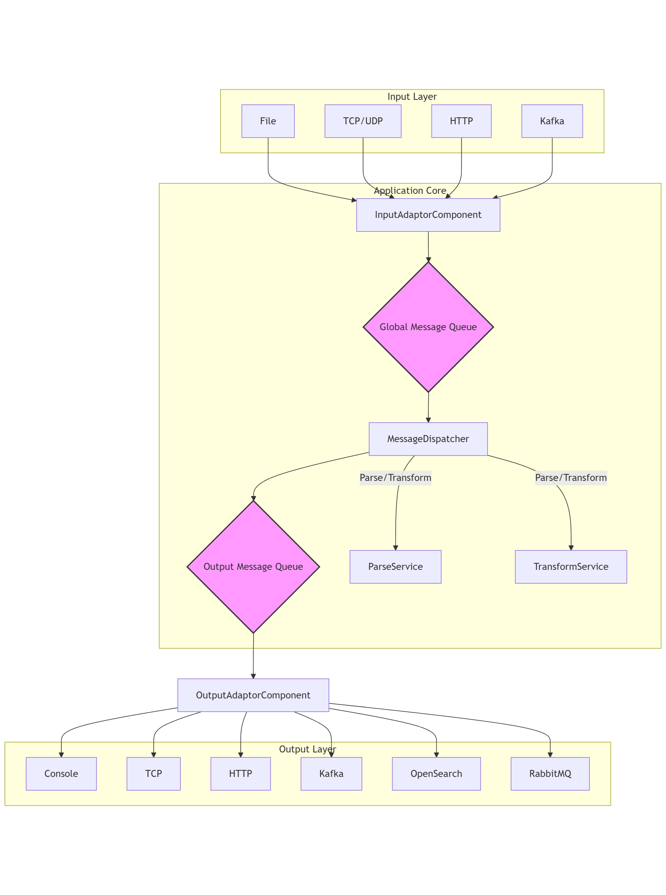
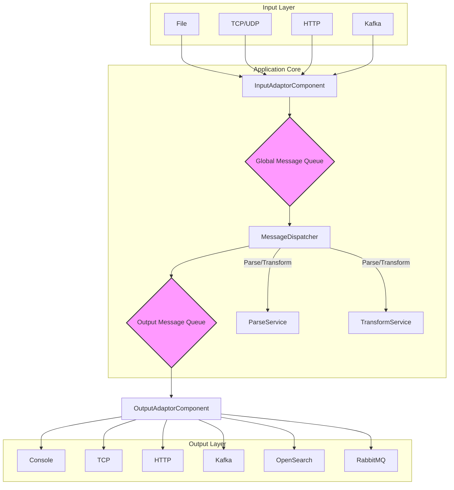

# Logparser - ETL Pipeline Application

**Version:** 0.2.3
**Java Version:** 21
**Spring Boot Version:** 3.5.8

## 프로젝트 개요

Logparser는 다양한 소스에서 로그 데이터를 수집하고, 파싱하며, 변환하여 여러 목적지로 전송하는 고성능 ETL(Extract, Transform, Load) 파이프라인 애플리케이션입니다.

### 주요 특징

- **설정 기반 아키텍처**: 코드 수정 없이 YAML 또는 데이터베이스 설정으로 전체 파이프라인 구성
- **다양한 입력 소스**: File, TCP, UDP, HTTP, Kafka 지원
- **유연한 파싱**: JSON, Grok, Regex, Syslog (RFC3164/RFC5424) 파서 제공
- **강력한 변환 기능**: 필터링, 필드 추가/제거 등의 변환 지원
- **다중 출력 대상**: Console, TCP, HTTP, Kafka, OpenSearch, RabbitMQ 지원
- **고성능 처리**: 멀티스레드 기반 병렬 처리 (기본 4개 파서 스레드)
- **대용량 큐**: 기본 20,000개 메시지 버퍼링 지원
- **운영 안정성**: Dead Letter Queue, 백프레셔, 큐 모니터링, JMX 지원
- **Hot Reload**: 애플리케이션 재시작 없이 설정 변경 가능
- **REST API**: 전체 설정을 관리할 수 있는 포괄적인 REST API 제공

## 아키텍처

### 계층 구조

```
├── interfaces/          # REST API 계층 (Controllers, DTOs, Exception Handlers)
├── application/         # 애플리케이션 서비스 계층 (Use cases, Pipeline)
│   ├── config/         # 설정 관리 서비스
│   └── pipeline/       # 핵심 파이프라인 컴포넌트
├── domain/             # 도메인 계층 (비즈니스 로직)
│   ├── model/          # 도메인 모델 (LogEvent, FailedMessage)
│   ├── ingestion/      # 입력 어댑터
│   ├── parsing/        # 파서 구현
│   ├── transformation/ # 변환 구현
│   ├── delivery/       # 출력 어댑터
│   └── configuration/  # 설정 모델 및 검증
└── infrastructure/     # 인프라 계층
    ├── persistence/    # JPA 엔티티, 리포지토리
    ├── config/         # Spring 설정
    ├── monitoring/     # JMX 모니터링
    └── util/           # 유틸리티 (ThreadManager, DLQ 등)
```

### 데이터 흐름

```
[입력 소스]
    ↓
[InputAdaptorComponent] → 각 어댑터를 별도 스레드로 실행
    ↓
[Global Message Queue] → 20,000개 용량의 BlockingQueue
    ↓
[MessageDispatcher] → 멀티스레드 처리 (기본 4개 스레드)
    ├─ [ParseService] → 우선순위 기반 파서 실행
    └─ [TransformService] → 우선순위 기반 변환 실행
    ↓
[Output Message Queue] → 20,000개 용량의 BlockingQueue
    ↓
[OutputAdaptorComponent] → 메시지 타입별 라우팅
    ↓
[출력 대상]
```

### 프로젝트 구조도



<details>
  <summary>Click to expand (Mermaid)</summary>


```mermaid
graph TD
    subgraph Input Layer
        A[File]
        B[TCP/UDP]
        C[HTTP]
        D[Kafka]
    end
    subgraph Application Core
        E[InputAdaptorComponent] --> F{Global Message Queue};
        F --> G[MessageDispatcher];
        G --> H{Output Message Queue};
        I[ParseService]
        J[TransformService]
        G -- Parse/Transform --> I;
        G -- Parse/Transform --> J;
    end
    subgraph Output Layer
        K[Console]
        L[TCP]
        M[HTTP]
        N[Kafka]
        O[OpenSearch]
        P[RabbitMQ]
    end
    A & B & C & D --> E;
    H --> Q[OutputAdaptorComponent];
    Q --> K & L & M & N & O & P;
    style F fill:#f9f,stroke:#333,stroke-width:2px
    style H fill:#f9f,stroke:#333,stroke-width:2px
```
</details>

## 기술 스택

### 핵심 프레임워크
- **Java 21** (Eclipse Temurin)
- **Spring Boot 3.5.8**
- **Gradle 8.10.2**

### 데이터베이스 & 영속성
- **SQLite** (Xerial JDBC 3.47.1.0)
- **Hibernate** (Community Dialects 6.6.4.Final)
- **Flyway** (10.21.0) - 데이터베이스 마이그레이션
- **Spring Data JPA**

### 주요 라이브러리
- **Grok** (io.krakens:java-grok 0.1.9) - 로그 파싱
- **Gson 2.10.1** - JSON 처리
- **Apache HttpClient** - HTTP 통신
- **Spring Kafka** - Kafka 통합
- **Spring AMQP** - RabbitMQ 통합
- **Elasticsearch Client** - OpenSearch/Elasticsearch 통합

### DevOps
- **Docker** (Eclipse Temurin JRE 기반)
- **Docker Compose**
- **SonarQube** - 코드 품질 분석

## 주요 기능

### 1. 입력 어댑터 (Input Adapters)
- **FileInputAdapter**: 파일 읽기 (tail -f 방식)
- **TcpInputAdapter**: TCP 서버
- **UdpInputAdapter**: UDP 리스너
- **HttpInputAdapter**: HTTP POST 엔드포인트
- **KafkaInputAdapter**: Kafka 컨슈머
- **FakeInputAdapter**: 테스트 데이터 생성기

### 2. 파서 (Parsers)
- **JsonParser**: JSON 로그 파싱
- **GrokParser**: Grok 패턴 기반 파싱
- **RegexParser**: 정규표현식 파싱
- **RFC3164SyslogParser**: BSD Syslog 포맷
- **RFC5424SyslogParser**: 최신 Syslog 포맷
- **HttpParser**: HTTP 요청 파싱

### 3. 변환 (Transforms)
- **Filter**: 필드 값 기반 포함/제외 필터링
- **AddProperty**: 필드 추가 또는 중첩
- **RemoveProperty**: 불필요한 필드 제거

### 4. 출력 어댑터 (Output Adapters)
- **ConsoleOutputAdapter**: 표준 출력
- **TcpOutputAdapter**: TCP 클라이언트
- **HttpOutputAdapter**: HTTP POST 전송
- **KafkaOutputAdapter**: Kafka 프로듀서
- **OpenSearchOutputAdapter**: OpenSearch/Elasticsearch Bulk API
- **RabbitMQAdapter**: RabbitMQ 익스체인지 퍼블리셔
- **BenchmarkAdapter**: 성능 측정

### 5. 운영 기능
- **Dead Letter Queue**: 실패한 메시지를 파일에 저장 (5분마다 자동 flush)
- **Queue Monitoring**: 30초마다 큐 사용률 체크 (80% 경고, 95% 위험)
- **Backpressure**: 큐 임계값 초과 시 자동 흐름 제어
- **Statistics**: 수신/처리/드롭/실패 카운터
- **JMX Monitoring**: LogParserMonitoring MBean
- **Configuration Versioning**: 설정 버전 관리 및 롤백
- **Audit Trail**: 설정 변경 이력 추적

## 사용 방법

### 1. 빌드

```bash
./gradlew build
```

### 2. 실행

#### Standalone JAR
```bash
java -jar build/libs/logparser-0.2.3.jar
```

#### Docker
```bash
docker build --build-arg APP_VERSION=0.2.3 -t keinus/logparser:latest .
docker run -p 443:443 -v ./logs:/app/log -v ./config.yaml:/app/config/config.yaml:ro keinus/logparser:latest
```

#### Docker Compose
```bash
docker-compose up -d
```

### 3. 설정

#### 데이터베이스 설정 (기본)
애플리케이션은 기본적으로 SQLite 데이터베이스(`${user.home}/logparser/data/config.db`)에서 설정을 로드합니다.

REST API를 통해 설정 관리:
```bash
# 입력 어댑터 생성
curl -X POST http://localhost:443/api/v1/input-adapters \
  -H "Content-Type: application/json" \
  -d '{
    "type": "FileInputAdapter",
    "messagetype": "syslog",
    "path": "/var/log/syslog",
    "enabled": true
  }'

# 파서 생성
curl -X POST http://localhost:443/api/v1/parsers \
  -H "Content-Type: application/json" \
  -d '{
    "type": "RFC5424SyslogParser",
    "messagetype": "syslog",
    "priority": 1,
    "enabled": true
  }'

# 설정 리로드
curl -X POST http://localhost:443/api/v1/pipeline/reload
```

#### YAML 설정
`application.yml`에서 `logparser.config-source: YAML`로 변경 후 `config/config.yaml` 파일 사용:

```yaml
logparser:
  parser_threads: 4
  queue_size: 20000

  input:
    - type: FileInputAdapter
      path: "./logs/app.log"
      messagetype: applog

  parser:
    - type: JsonParser
      messagetype: applog
      priority: 1

  transform:
    - type: Filter
      messagetype: applog
      priority: 1
      param:
        pass:
          level: ["ERROR", "WARN"]

    - type: AddProperty
      messagetype: applog
      priority: 2
      param:
        add:
          environment: production

  output:
    - type: OpenSearchOutputAdapter
      messagetype: applog
      url: https://opensearch:9200
      index: logs-%{yyyy.MM.dd}
      username: admin
      password: admin
```

### 4. REST API

#### 파이프라인 관리
- `GET /api/v1/pipeline/status` - 파이프라인 상태 조회
- `POST /api/v1/pipeline/reload` - 설정 리로드
- `POST /api/v1/pipeline/restart` - 파이프라인 재시작

#### 설정 관리
- Input Adapters: `/api/v1/input-adapters`
- Parsers: `/api/v1/parsers`
- Transforms: `/api/v1/transforms`
- Output Adapters: `/api/v1/output-adapters`
- Common Settings: `/api/v1/settings`

각 엔드포인트는 CRUD 작업을 지원합니다.

#### 설정 Import/Export
- `GET /api/v1/config/export` - 설정을 YAML로 내보내기
- `POST /api/v1/config/import` - YAML 설정 가져오기

## 데이터베이스 스키마

### 주요 테이블
- `config_settings` - 키-값 설정 저장소
- `input_adapters` - 입력 어댑터 설정
- `parsers` - 파서 설정 (우선순위 관리)
- `transforms` - 변환 설정 (우선순위 관리)
- `output_adapters` - 출력 어댑터 설정
- `config_history` - 설정 변경 감사 추적
- `configuration_versions` - 설정 버전 스냅샷

### 마이그레이션
Flyway를 사용한 자동 마이그레이션:
- `V1__Initial_schema.sql` - 기본 테이블 생성
- `V2__Add_history_and_versions.sql` - 이력 및 버전 관리
- `V3__Add_indexes.sql` - 성능 인덱스
- `V4__Add_constraints.sql` - 데이터 무결성 제약조건

## 성능 및 모니터링

### 큐 설정
- **Global Queue Size**: 20,000 (기본값, 설정 가능)
- **Output Queue Size**: 20,000 (기본값, 설정 가능)
- **Parser Threads**: 4 (기본값, 설정 가능)

### 모니터링 메트릭
- 수신된 메시지 수
- 처리된 메시지 수
- 드롭된 메시지 수
- 실패한 메시지 수
- 큐 사용률 (%)
- Dead Letter Queue 통계

### Dead Letter Queue
- 위치: `./dlq/`
- 포맷: JSON 또는 CSV
- Flush 주기: 5분
- 최대 크기: 10,000 메시지

## 보안

### 인증 및 암호화
- OpenSearch/Elasticsearch: Basic Auth 지원
- RabbitMQ: Username/Password 인증
- 데이터베이스: 민감한 필드 자동 암호화 (CryptoConverter)
- HTTPS: SSL/TLS 지원 (자체 서명 인증서 허용)

### 포트
- REST API: 443 (기본값, 설정 가능)

## 개발

### 테스트 실행
```bash
./gradlew test
```

### 코드 품질 분석
```bash
./gradlew sonarqube
```

### 프로젝트 통계
- **총 Java 파일**: 127개
- **주요 컴포넌트**: 60+ 클래스
- **테스트 커버리지**: 주요 어댑터 및 파서 포함

## 라이선스 및 기여

이 프로젝트는 한국어 문서를 포함하며 한국 시장을 대상으로 개발되었습니다.

---

## 문서 정보

본 문서는 Claude Code를 통해 작성되었습니다.
