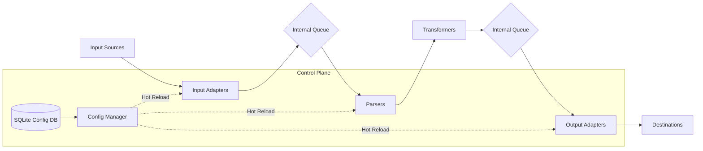

# Logparser (로그파서)

[](https://github.com/keinus/logparser)
[](https://opensource.org/licenses/MIT)
[](https://github.com/keinus/logparser)
[](https://www.oracle.com/java/)
[](https://spring.io/projects/spring-boot)

**Logparser**는 Spring Boot 기반의 고성능 로그 처리 파이프라인 엔진입니다. 다양한 프로토콜(TCP, UDP, HTTP, Kafka)을 통해 로그를 수집하고, 정교한 패턴 매칭(Grok, Regex)으로 데이터를 구조화하여, 여러 목적지(Kafka, OpenSearch, RDB 등)로 실시간 전달합니다.

데이터베이스 기반의 동적 설정 관리와 핫 리로드(Hot-Reload) 기능을 통해, 서비스 중단 없이 파이프라인 구성을 변경할 수 있습니다.

---

## 📋 목차

- [아키텍처](#-아키텍처)
- [주요 기능](#-주요-기능)
- [기술 스택](#-기술-스택)
- [시작하기](#-시작하기)
  - [전제 조건](#전제-조건)
  - [설치 및 실행](#설치-및-실행)
- [설정 가이드](#-설정-가이드)
- [API 명세](#-api-명세)
- [라이선스](#-라이선스)

---

## 🏗 아키텍처

Logparser의 데이터 처리 흐름은 다음과 같은 파이프라인 구조를 따릅니다:


```mermaid
graph LR
    Input[Input Sources] --> IA[Input Adapters]
    IA --> Q1{Internal Queue}
    Q1 --> P[Parsers]
    P --> T[Transformers]
    T --> Q2{Internal Queue}
    Q2 --> OA[Output Adapters]
    OA --> Dest[Destinations]

    subgraph "Control Plane"
        DB[(SQLite Config DB)] --> CM[Config Manager]
        CM -.->|Hot Reload| IA
        CM -.->|Hot Reload| P
        CM -.->|Hot Reload| OA
    end
```

1.  **Input Adapter**: 다양한 소스(File, TCP, Kafka 등)로부터 Raw 데이터를 수집합니다.
2.  **Parser**: 수집된 비정형 데이터를 구조화된 포맷(Map/JSON)으로 변환합니다 (Grok, Syslog 등).
3.  **Transformer**: 데이터 필터링, 마스킹, 필드 추가/삭제 등의 가공을 수행합니다.
4.  **Output Adapter**: 최종 데이터를 목적지(OpenSearch, Kafka 등)로 전달합니다.

---

## ✨ 주요 기능

| 분류 | 기능 | 설명 |
| :--- | :--- | :--- |
| **수집 (Ingestion)** | 다양한 프로토콜 지원 | File, HTTP, TCP, UDP, Kafka, Fake(테스트용) 어댑터 제공 |
| **분석 (Parsing)** | 강력한 패턴 매칭 | Grok, Regex, JSON, Syslog (RFC3164/5424), HTTP 로그 파싱 지원 |
| **전달 (Delivery)** | 멀티 채널 출력 | Console, HTTP, Kafka, OpenSearch, RabbitMQ, TCP 지원 |
| **운영 (Ops)** | **동적 설정 변경** | DB 기반 설정 관리 및 **Hot Reload** (재시작 없는 설정 적용) 지원 |
| | 스레드 모니터링 | 파이프라인별 스레드 상태 실시간 모니터링 API 제공 |
| **보안 (Security)** | 설정 암호화 | DB에 저장되는 민감 정보(비밀번호 등) 암호화 처리 |

---

## 🛠 기술 스택

- **Language**: Java 21
- **Framework**: Spring Boot 3.5.8
- **Build Tool**: Gradle
- **Database**: SQLite (설정 저장용), JPA/Hibernate
- **Parsing**: Java Grok, Gson
- **Messaging**: Spring Kafka, Spring AMQP
- **Docs**: SpringDoc OpenAPI (Swagger)

---

## 🚀 시작하기

### 전제 조건

- **Java JDK 21** 이상
- **Gradle** (포함된 `gradlew` 사용 권장)

### 설치 및 실행

1.  **저장소 클론**
    ```bash
    git clone https://github.com/keinus/logparser.git
    cd logparser
    ```

2.  **빌드**
    ```bash
    ./gradlew build
    ```

3.  **환경 변수 설정 (권장)**
    보안을 위해 암호화 키를 환경 변수로 설정합니다.
    ```bash
    export LOGPARSER_CRYPTO_KEY="$(openssl rand -base64 32)"
    export LOGPARSER_CRYPTO_SALT="$(openssl rand -hex 16)"
    ```

4.  **애플리케이션 실행**
    ```bash
    java -jar build/libs/logparser-0.2.3.jar
    ```

---

## ⚙ 설정 가이드

### `application.yml`
기본 애플리케이션 설정입니다. (`src/main/resources/application.yml`)

```yaml
server:
  port: 8765  # 기본 포트

logparser:
  config-source: DATABASE # 설정 소스 (DB)
  auto-reload: true       # 설정 변경 시 자동 리로드 활성화
  crypto:
    secret-key: ${LOGPARSER_CRYPTO_KEY} # 암호화 키
```

### 파이프라인 구성
파이프라인 구성(Input, Parser, Output)은 내장된 SQLite 데이터베이스(`~/logparser/data/config.db`)에 저장되며, REST API를 통해 관리됩니다.

---

## 📡 API 명세

서버 실행 후 **Swagger UI**를 통해 전체 API 명세를 확인하고 테스트할 수 있습니다.
- URL: `http://localhost:8765/swagger-ui.html`

### 주요 Endpoints

#### 1. 파이프라인 관리 (`/api/v1/pipeline`)

| Method | URI | 설명 |
| :--- | :--- | :--- |
| `GET` | `/status` | 현재 파이프라인 상태 조회 |
| `POST` | `/reload` | 설정 강제 리로드 |
| `POST` | `/restart` | 파이프라인 재시작 |
| `GET` | `/threads` | 파이프라인 스레드 상세 정보 모니터링 |

#### 2. 입력 어댑터 관리 (`/api/v1/input-adapters`)

| Method | URI | 설명 |
| :--- | :--- | :--- |
| `GET` | `/` | 모든 입력 어댑터 목록 조회 (Paging) |
| `POST` | `/` | 새로운 입력 어댑터 생성 |
| `GET` | `/{id}` | 특정 입력 어댑터 조회 |
| `PUT` | `/{id}` | 입력 어댑터 설정 수정 |
| `PATCH` | `/{id}/enable` | 입력 어댑터 활성화 |
| `PATCH` | `/{id}/disable` | 입력 어댑터 비활성화 |

*(Output Adapter, Parser, Transform API도 유사한 패턴을 따릅니다)*

#### 3. 시스템 설정 (`/api/v1/settings`)

| Method | URI | 설명 |
| :--- | :--- | :--- |
| `GET` | `/` | 전역 설정 목록 조회 |
| `PUT` | `/{key}` | 특정 설정 값 변경 (예: 스레드 풀 크기 등) |

---

## 📜 라이선스

이 프로젝트는 **MIT License** 하에 배포됩니다. 자세한 내용은 [LICENSE](LICENSE) 파일을 참조하세요.
