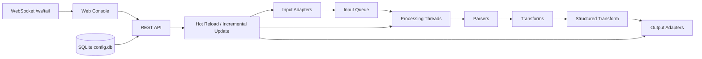

# Logparser

Logparser는 Spring Boot 기반의 로그 수집/파싱/변환/전송 파이프라인입니다.  
입력 어댑터, 파서, 변환기, 출력 어댑터 설정을 SQLite에 저장하고, 웹 콘솔과 REST API를 통해 실행 중에도 구성을 변경할 수 있습니다.

애플리케이션은 설정 DB가 비어 있어도 기동되며, 이후 UI 또는 API로 파이프라인을 채워 넣는 방식으로 사용할 수 있습니다.

## 주요 기능

- 입력, 파서, 변환, 출력 구성을 DB에 저장하고 동적으로 반영
- `messageType` 기준 파이프라인 구성
- 내장 웹 콘솔에서 Overview, Live Tail, Pipeline View, 설정 CRUD 제공
- REST API와 Swagger UI 제공
- WebSocket 기반 실시간 Live Tail
- 파서 테스트 API 및 파이프라인 검증 API 제공
- 구조화 변환(Structured Transform) 스키마 조회, 매핑 저장, 시뮬레이션 지원
- Flyway 기반 DB 스키마 관리
- 민감 정보(OpenSearch/RabbitMQ 비밀번호) 암호화 저장 지원

## 아키텍처


```mermaid
flowchart LR
    A[Input Adapters] --> B[Input Queue]
    B --> C[Processing Threads]
    C --> D[Parsers]
    D --> E[Transforms]
    E --> F[Structured Transform]
    F --> G[Output Adapters]

    UI[Web Console] --> API[REST API]
    WS[WebSocket /ws/tail] --> UI
    DB[(SQLite config.db)] --> API
    API --> RELOAD[Hot Reload / Incremental Update]
    RELOAD --> A
    RELOAD --> C
    RELOAD --> G
```

## 지원 컴포넌트

### Input Adapters

| 타입 | 설명 |
| --- | --- |
| `TcpInputAdapter` | TCP 소켓 수신 |
| `UdpInputAdapter` | UDP 패킷 수신 |
| `HttpInputAdapter` | HTTP 엔드포인트 수신 |
| `KafkaInputAdapter` | Kafka 토픽 소비 |
| `FileInputAdapter` | 파일 입력 |
| `FakeInputAdapter` | 테스트용 가짜 입력 생성 |

### Parsers

| 타입 | 설명 |
| --- | --- |
| `JsonParser` | JSON 로그 파싱 |
| `GrokParser` | Grok 패턴 기반 파싱 |
| `RegexParser` | 정규식 기반 파싱 |
| `RFC3164SyslogParser` | RFC3164 syslog 파싱 |
| `RFC5424SyslogParser` | RFC5424 syslog 파싱 |
| `HttpParser` | HTTP 액세스 로그 파싱 |

### Transforms

| 타입 | 설명 |
| --- | --- |
| `Filter` | 조건 기반 통과/드롭 |
| `AddProperty` | 필드 추가 |
| `RemoveProperty` | 필드 제거 |
| `Structure` | 공통/서브 스키마 기반 구조화 변환 |

### Output Adapters

| 타입 | 설명 |
| --- | --- |
| `ConsoleOutputAdapter` | 콘솔 출력 |
| `TcpOutputAdapter` | TCP 전송 |
| `HttpOutputAdapter` | HTTP 전송 |
| `KafkaOutputAdapter` | Kafka 토픽 전송 |
| `OpenSearchOutputAdapter` | OpenSearch/Elasticsearch 인덱싱 |
| `RabbitMQAdapter` | RabbitMQ 발행 |
| `BenchmarkAdapter` | 성능 측정용 출력 |

## 프로젝트 구조

```text
src/main/java/org/keinus/logparser
├── application      # 파이프라인 실행, 디스패처, 모니터링
├── domain           # 입력/파싱/변환/출력 핵심 로직
├── infrastructure   # 설정, JPA, 유틸리티, 컨버터
└── interfaces       # REST API, WebSocket, DTO, 예외 처리

src/main/resources
├── application.yml
├── db/migration     # Flyway SQL
└── static           # 내장 웹 콘솔
```

## 기술 스택

| 분류 | 기술 |
| --- | --- |
| Backend | Java 21, Spring Boot 3.5.10, Gradle |
| Web | Spring Web, Spring WebSocket, Spring Validation |
| Persistence | Spring Data JPA, SQLite, Flyway |
| Messaging | Spring Kafka, Spring AMQP |
| Parsing | java-grok, Regex, Syslog Parser |
| API Docs | springdoc-openapi |
| Frontend | HTML, Vanilla JS, Tailwind CSS, DaisyUI, Chart.js |
| Test | JUnit 5, Spring Boot Test, H2 |

## 실행 환경

### 요구 사항

- JDK 21

### 빠른 실행

```bash
./gradlew bootRun
```

기본 접속 주소:

- 웹 콘솔: `http://localhost:8765/`
- Swagger UI: `http://localhost:8765/swagger-ui.html`
- OpenAPI JSON: `http://localhost:8765/api-docs`

### 빌드 및 실행

```bash
./gradlew build
java -jar build/libs/logparser-0.3.0.jar
```

### 테스트

```bash
./gradlew test
```

테스트는 `src/test/resources/application-test.yml` 기준으로 H2 메모리 DB를 사용합니다.

## 설정 저장소와 데이터 경로

- 운영 설정 저장소: `${user.home}/logparser/data/config.db`
- DB 스키마 초기화: Flyway `src/main/resources/db/migration`
- 기본 서버 포트: `8765`
- 주요 공통 설정 키:
  - `parser_threads`
  - `flush_interval`

설정 변경 시 이벤트 기반으로 입력/출력 어댑터를 즉시 반영하고, 파서/변환기는 리로드됩니다.  
전체 검증 후 재시작이 필요하면 `/api/v1/pipeline/validate-and-reload` 또는 `/api/v1/pipeline/reload`를 사용할 수 있습니다.

## 메모리 / CPU 운영 가이드

- 입력 큐 기본 크기인 `10000`은 이벤트 객체가 큐에 오래 쌓일 경우 heap 사용량을 빠르게 키웁니다.
- 작은 장비나 sink latency가 긴 환경에서는 queue 크기를 낮추는 편이 안전합니다.
- `parser_threads`는 CPU 코어 수와 sink latency를 같이 보고 조정해야 합니다.
- 동기 출력 구조이므로 느린 output sink 하나가 processing worker를 오래 점유할 수 있습니다.

권장 시작값:

- 2 vCPU / 2~4 GB RAM:
  - `log.message.queue-size=1000~3000`
  - `parser_threads=2`
- 4 vCPU / 4~8 GB RAM:
  - `log.message.queue-size=3000~7000`
  - `parser_threads=4`
- output sink가 Kafka/OpenSearch/RabbitMQ처럼 네트워크 지연 영향을 크게 받으면:
  - 먼저 queue size를 늘리기보다 sink timeout과 retry를 줄이는 쪽을 우선 권장

점검 항목:

- input queue가 자주 가득 차는지
- output adapter failure와 latency가 함께 증가하는지
- Live Tail 활성화 시 WebSocket session 수가 비정상적으로 남는지
- reload 이후 thread 수와 adapter 수가 원래대로 돌아오는지

## 보안 설정

민감 값 암호화가 필요한 출력 어댑터(OpenSearch, RabbitMQ)를 사용할 경우 아래 환경 변수를 설정하는 것이 좋습니다.

```bash
export LOGPARSER_CRYPTO_KEY="$(openssl rand -base64 32)"
export LOGPARSER_CRYPTO_SALT="$(openssl rand -hex 16)"
```

`application.yml`에는 개발용 기본값이 있으나, 운영 환경에서는 반드시 별도 값을 사용해야 합니다.

## 웹 콘솔

기본 웹 콘솔은 정적 리소스로 내장되어 있으며 별도 프론트엔드 빌드가 필요하지 않습니다.

주요 화면:

- `Overview`: 파이프라인 상태, 처리량, 큐, 스레드 현황
- `Live Tail`: WebSocket 기반 실시간 로그 스트림
- `Pipeline View`: `messageType` 기준 토폴로지 시각화
- `Sources / Parsers / Transforms / Destinations`: 설정 CRUD
- `System Settings`: 공통 설정 관리

## 주요 API

상세 스펙은 Swagger UI에서 확인할 수 있습니다.

### Pipeline / Monitoring

- `GET /api/v1/pipeline/status`
- `GET /api/v1/pipeline/topology`
- `GET /api/v1/pipeline/threads`
- `POST /api/v1/pipeline/reload`
- `POST /api/v1/pipeline/validate-and-reload`
- `POST /api/v1/pipeline/restart`
- `GET /api/v1/pipeline/livetail/status`
- `POST /api/v1/pipeline/livetail/enable`
- `POST /api/v1/pipeline/livetail/disable`

### Input / Parser / Transform / Output CRUD

- `GET|POST /api/v1/input-adapters`
- `GET|PUT|DELETE /api/v1/input-adapters/{id}`
- `PATCH /api/v1/input-adapters/{id}/enable`
- `PATCH /api/v1/input-adapters/{id}/disable`

- `GET|POST /api/v1/parsers`
- `GET|PUT|DELETE /api/v1/parsers/{id}`
- `PATCH /api/v1/parsers/{id}/priority`
- `POST /api/v1/parsers/test`
- `POST /api/v1/parsers/validate`

- `GET|POST /api/v1/transforms`
- `GET|PUT|DELETE /api/v1/transforms/{id}`
- `PATCH /api/v1/transforms/{id}/priority`

- `GET|POST /api/v1/output-adapters`
- `GET|PUT|DELETE /api/v1/output-adapters/{id}`
- `PATCH /api/v1/output-adapters/{id}/enable`
- `PATCH /api/v1/output-adapters/{id}/disable`

### Metadata / Validation / Settings

- `GET /api/v1/metadata/input-adapter-types`
- `GET /api/v1/metadata/parser-types`
- `GET /api/v1/metadata/transform-types`
- `GET /api/v1/metadata/output-adapter-types`
- `GET /api/v1/metadata/*-schema/{type}`
- `GET /api/v1/metadata/supported-codecs`
- `GET /api/v1/metadata/supported-http-methods`

- `GET /api/v1/validate/pipeline`
- `POST /api/v1/validate/input`
- `POST /api/v1/validate/parser`
- `POST /api/v1/validate/transform`
- `POST /api/v1/validate/output`

- `GET /api/v1/settings`
- `PUT /api/v1/settings`
- `GET /api/v1/settings/{key}`
- `PUT /api/v1/settings/{key}`

### Structured Transform

- `GET /api/v1/structure/schema`
- `GET /api/v1/structure/mapping/{messageType}`
- `POST /api/v1/structure/mapping`
- `POST /api/v1/structure/simulate`

### WebSocket

- `WS /ws/tail`

Live Tail 데이터 브로드캐스트는 기본적으로 비활성화되어 있으며, 먼저 `POST /api/v1/pipeline/livetail/enable` 호출이 필요합니다.

## 예시 요청

### 1. HTTP 입력 추가

```bash
curl -X POST http://localhost:8765/api/v1/input-adapters \
  -H 'Content-Type: application/json' \
  -d '{
    "type": "HttpInputAdapter",
    "messagetype": "http-access",
    "port": 8088,
    "pathPattern": "/ingest",
    "codec": "plain",
    "enabled": true
  }'
```

### 2. 파서 테스트

```bash
curl -X POST http://localhost:8765/api/v1/parsers/test \
  -H 'Content-Type: application/json' \
  -d '{
    "type": "GrokParser",
    "param": "%{IP:client_ip} %{WORD:method} %{URIPATHPARAM:uri}",
    "sampleData": "192.168.0.10 GET /health"
  }'
```

### 3. 콘솔 출력 추가

```bash
curl -X POST http://localhost:8765/api/v1/output-adapters \
  -H 'Content-Type: application/json' \
  -d '{
    "type": "ConsoleOutputAdapter",
    "messagetype": "http-access",
    "enabled": true,
    "addOriginText": true
  }'
```

## 참고 사항

- 설정 DB가 비어 있으면 애플리케이션은 기동되지만 파이프라인은 비활성 상태입니다.
- 파서가 없는 `messageType`은 경고만 남기고 그대로 통과할 수 있습니다.
- 출력 어댑터가 없는 `messageType`은 검증 경고 대상입니다.

## 라이선스

MIT License
