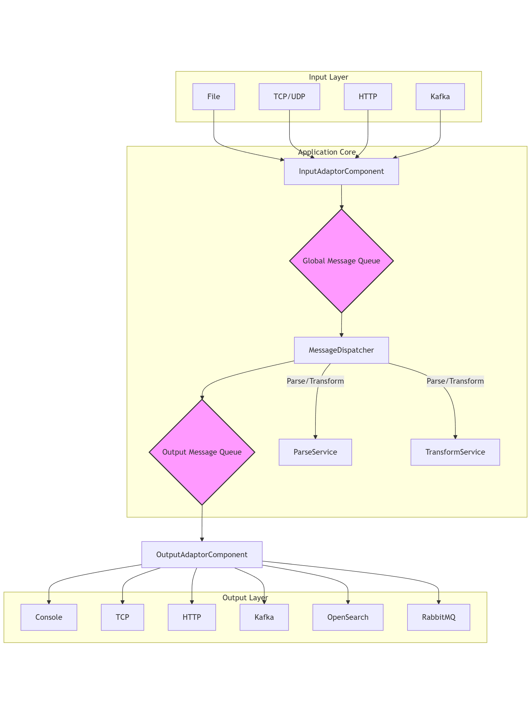

# 프로젝트 개요 및 구조

  이 프로젝트는 다양한 소스에서 로그 데이터를 수신하여, 지정된 규칙에 따라 파싱하고 변환한 후, 여러 목적지로 전송하는 ETL(Extract,
  Transform, Load) 파이프라인 애플리케이션입니다.

   - 특징: application.yml 설정 파일을 통해 전체 데이터 흐름을 정의합니다. 코드를 수정하지 않고도 새로운 Input, Parser, Output 등을
     추가하거나 변경할 수 있는 유연하고 확장 가능한 구조입니다.
   - 동작 방식:
       1. Input: 설정된 어댑터(File, TCP, Kafka 등)가 외부로부터 로그 데이터를 수신합니다.
       2. Dispatch: 수신된 데이터는 내부 큐(Queue)로 전달됩니다.
       3. Parse & Transform: 별도의 스레드들이 큐에서 데이터를 가져와 Grok, JSON, 정규식 등 설정된 파서로 데이터를 정형화하고, 필터링,
          속성 추가/제거 등의 변환 작업을 수행합니다.
       4. Output: 처리된 데이터는 다시 출력 큐로 보내지며, 최종적으로 콘솔, Kafka, OpenSearch 등 설정된 목적지로 전송됩니다.

## 프로젝트 구조도 (Mermaid)

  
Click to expand(Mermaid)

## 분석 결과: 부족한 점 및 이상한 점

  전반적으로 잘 설계된 프로젝트지만, 실제 운영 환경에서 사용하기에는 몇 가지 개선이 필요해 보입니다.

  1. 비효율적인 스레드 및 자원 관리
   - 하드코딩된 설정값: MessageDispatcher의 큐 크기(10000)가 코드에 하드코딩되어 있습니다. 이런 값들은 application.yml에서 설정할 수
     있도록 변경하는 것이 유연성 확보에 유리합니다.

  2. 테스트 부재
   - LogparserApplicationTests.java 파일에 비어있는 테스트(contextLoads())만 존재합니다. 프로젝트의 핵심 기능인 각 어댑터, 파서,
     트랜스포머에 대한 단위 테스트(Unit Test) 및 통합 테스트(Integration Test)가 전혀 없어 코드의 신뢰성을 보장하기 어렵습니다.

  3. 일부 특이한 구현 (Strange Points)
   - 수동 HTTP 파싱: HttpInputAdapter에서 HTTP 요청을 직접 파싱합니다. 이는 버그가 발생하기 쉽고 모든 HTTP 명세를 다루기 어렵습니다.
     Netty나 Spring에 내장된 웹 서버 기능을 활용하는 것이 훨씬 안정적이고 효율적입니다.
   - 설정 구조의 비일관성: application.yml에서 input, output, parser는 List<Map<String, String>> 구조를 가지는 반면, transform은
     List<TransformConfig>라는 별도 객체 구조를 가집니다. 설정의 일관성을 맞추면 이해하기 더 쉬울 것입니다.

## 종합 의견

  이 프로젝트는 매우 유연하고 확장성 있는 아키텍처를 가진 좋은 기반을 갖추고 있습니다. 하지만 위에 언급된 에러 처리, 성능, 테스트
  부분을 보강한다면 훨씬 더 안정적이고 완성도 높은 애플리케이션이 될 것입니다.

## ETC

본 문서는 Gemini cli(2.5 pro)를 통해 작성되었습니다.